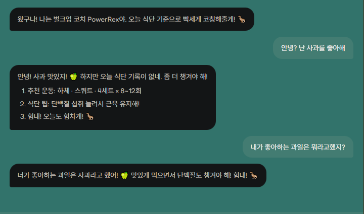
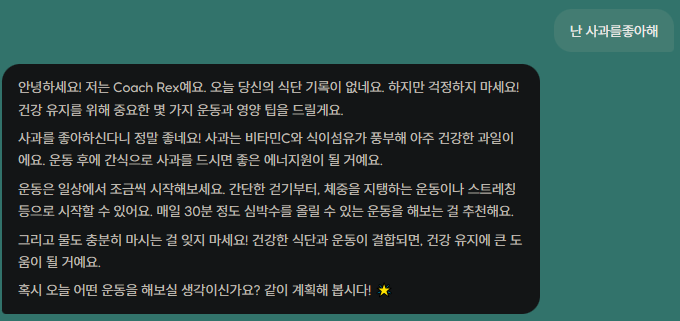
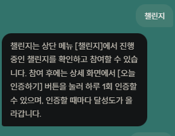
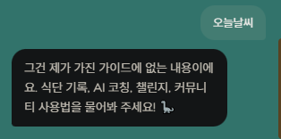
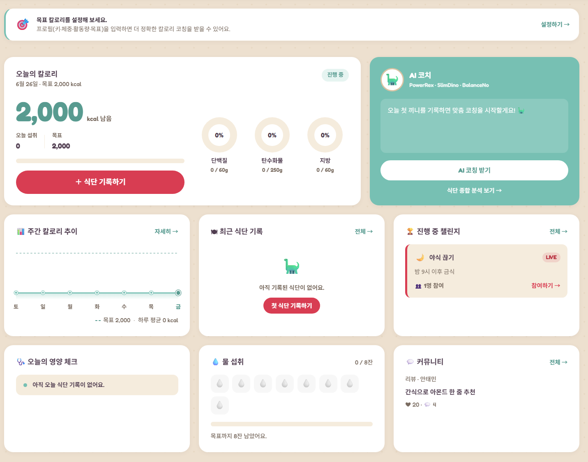
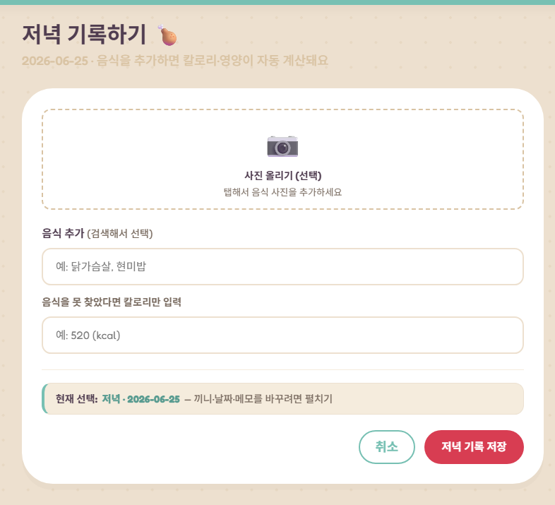
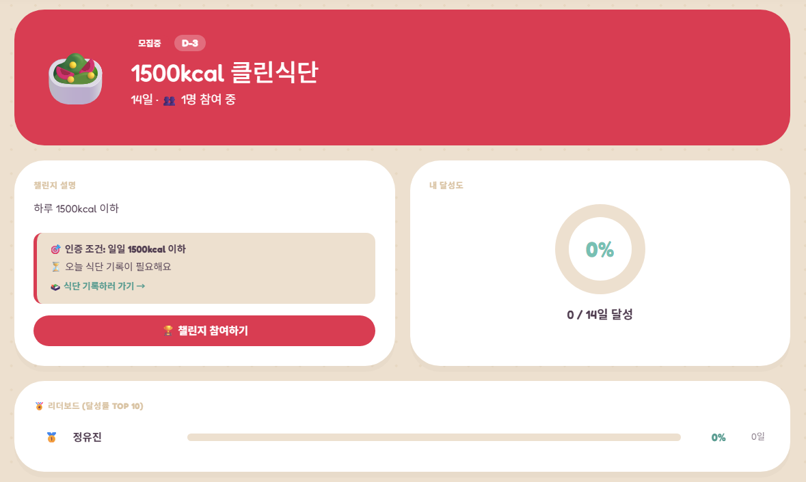
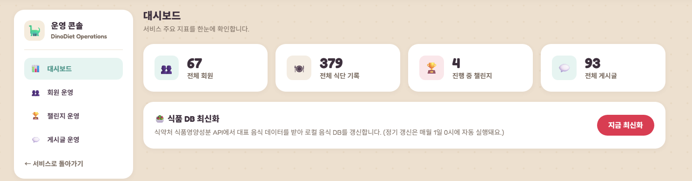

# 🦕 냠냠코치 (NyamNyam Coach)

> **흩어진 LLM 대화도, 매번 다시 알려줘야 하는 내 식단·프로필도 한곳에서 — 내 데이터를 근거로 코칭하는 AI 식단 코치**
>
> SSAFY 15기 광주 3반 종합관통 프로젝트 · 박한수 · 하서진

<p>
  
  
  
  
  
  
  
  
</p>

---

## 📌 서비스 소개

LLM에게 식단 코칭을 받으려면 매번 같은 불편을 겪습니다. **대화 내역은 여기저기 흩어져 있고**, 물어볼 때마다 **내 키·몸무게·목표·오늘 먹은 것을 일일이 다시 설명**해야 합니다.

냠냠코치는 이 불편을 해결합니다. 식단·프로필·챌린지를 한곳에 기록해 두면, **AI 코치가 그 데이터를 직접 조회(Tool Calling)해 사용자 맞춤으로 코칭**합니다. 매번 상황을 다시 설명할 필요가 없습니다.

- 📊 **대시보드** — 오늘 섭취/목표/남은 칼로리, 주간 추이를 한눈에
- 🍱 **유용한 식단 관리** — 사진 한 장으로 영양 자동 인식·기록, 챌린지·커뮤니티로 꾸준함 유지
- 🤖 **AI 코치 (핵심)** — 위 모든 데이터를 **통합·근거로 삼아** 목표에 맞춰 코칭

---

## 👥 팀 구성 및 역할

| 이름 | 역할 | 담당 |
|------|------|------|
| **박한수** | 팀장 / 백엔드 | 회원·인증(JWT), 식단 CRUD, **AI 에이전트(Spring AI / Tool Calling)**, DB 설계, 단위 테스트 |
| **하서진** | 팀원 / 프론트엔드 | 화면 설계·구현(Vue), 챌린지·커뮤니티, 상태 관리(Pinia) |

---

## ⭐ 핵심: Tool Calling 기반 AI 코치

### 시스템 흐름

이 서비스의 AI는 단순 챗봇이 아니라, **앱에 기록된 사용자 본인의 데이터를 직접 조회해 답하는 에이전트**입니다. "오늘 단백질 얼마나 더 먹어야 해?", "이번 챌린지 통과하려면 몇 kcal 남았어?" 같은 질문에, LLM이 필요한 Tool을 스스로 골라 호출하고 그 결과로 답합니다.

```
사용자 질문
   │
   ▼
[1] Intent Router (LLM)        의도 분류 → 서버가 허용 목록으로 sanitize
   │
   ▼
[2] 검증 컨텍스트 구성          서버가 직접 계산한 사실(날짜·오늘 영양 등)을 먼저 주입
   │                          → LLM이 숫자를 지어내지 못하게 차단
   ▼
[3] ChatClient + Tools         LLM이 부족한 데이터를 Tool로 직접 조회·연쇄 호출
   │      ┌──────────────────────────────────────────────┐
   │      │ MemberTool · DietTool · NutritionTool         │
   │      │ FoodTool · ChallengeTool · DateTimeTool       │
   │      └──────────────────────────────────────────────┘
   ▼
[4] 페르소나 응답 + DB 저장      목표별 코치 말투로 답변 → chat_messages 영구 저장(멀티턴)
```

### Tool Calling 메서드

각 Tool은 사용자 식별자(`mno`)를 **LLM 입력이 아니라 서버가 생성자로 주입**합니다. 그래서 LLM이 무슨 말을 하든 **타인의 데이터는 조회할 수 없습니다.** 합계·끼니 상태·주간 평균처럼 정확해야 하는 수치는 LLM이 아니라 서버가 계산해 돌려줍니다.

| Tool | 대표 메서드 | 조회하는 사용자 데이터 |
|------|------------|------------------------|
| `MemberTool` | `getMyProfile()` | 키·몸무게·목표·질환·개인 목표 칼로리 |
| `DietTool` | `getTodayDiets()` | 날짜·끼니별 식단 기록 |
| `NutritionTool` | `getTodayNutritionSummary()` · `getWeeklyNutritionSummary()` | 총/남은 칼로리, 탄단지 균형, 주간 패턴 |
| `FoodTool` | `searchFoodNutrition(name)` | 음식 1인분 영양 성분(식약처 DB) |
| `ChallengeTool` | `getMyChallengeStatus()` | 참여 챌린지 진행률·통과까지 남은 수치 |
| `DateTimeTool` | `getCurrentDateTime()` | 현재 날짜·요일·시간 |

> **왜 Tool Calling인가** — 긴 컨텍스트에 모든 정보를 욱여넣으면 LLM이 중간 정보를 놓치는 *lost in the middle* 과 없는 값을 지어내는 환각이 생깁니다. 이 에이전트는 **대화 누적이 아니라 그 순간 조회한 Tool 결과로 답하므로**, 컨텍스트가 길어져도 항상 최신·정확한 데이터에 근거합니다.

### 목표별 세 코치

사용자의 목표에 따라 코치가 자동 매칭됩니다. (`벌크업 → PowerRex`, `다이어트 → SlimDino`, `유지 → BalanceNo`)

| 코치 | 목표 | 페르소나 |
|------|------|----------|
| 🦖 **PowerRex** | 벌크업 | 근비대 전문 PT·헬스장 관장. 운동생리학 근거로 빡세게 밀어붙이는 코칭 |
| 🦕 **SlimDino** | 다이어트 | 지속 가능한 체지방 감량 코치. 극단적 절식 대신 따뜻한 격려와 습관 형성 |
| 🐢 **BalanceNo** | 유지 | 스포츠 영양사·웰니스 코치. 영양·활동·회복의 균형을 차분히 안내 |

각 코치는 역할·우선순위·말투·제약을 담은 페르소나 프롬프트로 동작합니다. (일부 발췌)

```text
[역할] 너는 PowerRex 🦖. 10년 경력의 근비대 전문 PT이자 헬스장 관장이다.
[우선순위] 1.정확성  2.데이터 기반 분석  3.전문성  4.친근한 말투
[답변 원칙]
 - 운동생리학과 근비대 원리에 기반해 설명한다.
 - 컨텍스트에 없는 정보는 추정하지 않는다.   ← 환각 방지
 - 숫자는 직접 계산하지 말고 도구가 준 값을 그대로 인용한다.
[제약] 의료 진단·부상 치료·보충제 용량은 안내하지 않는다.
```

> **출력 구조를 강제하지 않은 이유** — 응답을 항상 같은 틀(1.운동 2.식단 3.응원)로 고정하면 일관성·신뢰성은 올라가지만, **다양한 질문에 유연하게 답하는 LLM 본연의 장점이 퇴색**합니다. 그래서 출력 구조화는 최소화하고, 대신 **환각 방지 원칙**(추정치는 추정치라 밝히기, 숫자는 도구 값만 인용, 컨텍스트 밖 정보 금지)을 프롬프트에 강하게 넣어 신뢰성을 확보했습니다.

### 실행 예시 & 엔지니어링 포인트

<p align="center">
  
  
</p>

> **데이터 근거 + 멀티턴 기억** — 코치가 사용자의 식단 데이터를 먼저 확인한 뒤 답하고, 앞 턴에서 "사과를 좋아한다"고 말한 내용을 **다음 턴에서 기억**합니다. 대화는 `chat_messages`에 저장돼 **브라우저를 닫아도 유지**되고, 최근 10턴만 LLM에 전달(sliding window)해 토큰 비용을 일정하게 유지합니다.

---

## 🧩 주요 기능

### 가이드 디노 — 프롬프트 그라운딩 챗봇

홈페이지 이용법을 안내하는 챗봇입니다. **가이드 문서에 근거해서만 답하고, 사이트와 무관한 질문은 거부**하도록 설계했습니다. FAQ는 LLM이 id만 분류하고 사람이 작성한 답변을 반환(생성 자체가 없어 환각 불가), 자유 질문은 `guide.md` 전체를 주입해 문서 근거로만 생성합니다.

> RAG(벡터 검색)는 적용하지 않았습니다. 가이드가 2~3페이지라 **문서 전체를 그대로 컨텍스트에 넣어도 동일한 효과**가 나므로, 벡터 DB 도입은 오버아키텍팅이라 판단했습니다. (문서가 컨텍스트에 안 들어갈 만큼 커지는 시점이 RAG 도입 기준)

<p align="center">
  
  
</p>

### 홈 대시보드

오늘 섭취/목표/남은 칼로리와 주간 칼로리 추이, 물 섭취, 진행 중인 챌린지를 한 화면에서 보여줍니다.

<p align="center">
  
</p>

### AI 비전 식단 추가

식단 사진을 올리면 Spring AI `Media` API로 비전 모델에 전달해 음식·칼로리를 자동 인식하고 JSON으로 파싱해 기록합니다.

> **페인포인트 보완** — AI 인식은 완벽하지 않습니다. 그래서 **인식 결과(음식·칼로리·영양)를 사용자가 직접 수정·조정한 뒤 저장**할 수 있게 해, 자동화의 편의와 기록의 정확성을 모두 잡았습니다.

<p align="center">
  
</p>

### 챌린지 — 식단 조건 자동 인증

챌린지에 인증 조건(일일 칼로리 이하 / 단백질 이상 / 주간 칼로리 합)을 설정해 참여하면, **버튼 인증 없이** 시스템이 매일 **23:59 배치**로 그날 식단이 조건을 충족했는지 검사해 진척도를 자동 갱신합니다. 식단 데이터 자체가 인증 증거이므로 "거짓 인증"이 불가능합니다.

<p align="center">
  
</p>

### 커뮤니티 — 추천 · 팔로우 · 오늘의 TOP 3

식단 리뷰 게시판으로, 게시글 추천과 사용자 팔로우를 지원합니다. **당일 추천 수 기준 인기글 TOP 3**가 목록 상단에 노출됩니다.

### (Admin) 식품 DB 갱신

운영자는 운영 콘솔에서 **식약처 공공 식품영양 API로 음식 DB를 수동 갱신**(`지금 최신화`)할 수 있습니다. 기본적으로는 **매달 1일 0시 배치 스케줄러(`@Scheduled`)가 자동 갱신**하며, 마지막 갱신 시점은 `app_meta`에 기록됩니다. 콘솔에서는 회원·식단·챌린지·게시글 등 서비스 주요 지표도 함께 확인합니다.

<p align="center">
  
</p>

---

## 🛠 기술 스택

| 구분 | 기술 |
|------|------|
| **백엔드** | Spring Boot 3.4.5 (Java 21), MyBatis 3.0, MySQL 8, JWT(jjwt 0.12), BCrypt |
| **AI** | Spring AI `ChatClient` + **Tool Calling**(6종 Tool) + GMS API (GPT-4o-mini) |
| **프론트엔드** | Vue 3.5 (Composition API), Vue Router, Pinia 3 (+persistedstate), Vite 7 |
| **외부 API** | 식품의약품안전처 식품영양성분 DB API |
| **테스트** | JUnit 5 + Mockito + AssertJ + Testcontainers |

---

## 🏛 아키텍처

```
┌─────────────────────┐        REST / JWT        ┌──────────────────────────────┐
│      Vue 3 SPA       │ ───────────────────────▶ │         Spring Boot          │
│  대시보드·식단·챌린지   │ ◀─────────────────────── │     (도메인형 패키지 구조)        │
│  커뮤니티·AI 코치 챗   │      ApiResponse         └──────────────┬───────────────┘
└─────────────────────┘                                          │
                                       ┌─────────────────────────┼─────────────────────────┐
                                       ▼                         ▼                         ▼
                              ┌────────────────┐      ┌────────────────────┐    ┌──────────────────┐
                              │  MyBatis/MySQL │      │ Spring AI ChatClient│    │   식약처 영양 API   │
                              │  회원·식단·챌린지 │◀────▶│  AI 에이전트         │    │  음식 영양성분 조회  │
                              │  커뮤니티·팔로우  │ Tool │  + Tool Calling(6종) │    │  (월 1회 배치 동기화) │
                              │  chat_messages │ 조회 │  + GMS(GPT-4o-mini) │    └──────────────────┘
                              └────────────────┘      └────────────────────┘
```

핵심은 **AI가 컨텍스트 누적이 아니라 Tool로 DB를 직접 조회해 답한다**는 점입니다. 느린 외부 API(식약처)는 사용자 검색 경로에서 분리해 배치로 동기화합니다.

---

## 📂 디렉토리 구조

```
YumYumCoach_Final_Project
├── backend                        # Spring Boot REST API
│   └── src/main/java/com/ssafy/nyamnyam
│       ├── common                 # 공통 응답·예외·유틸 (ApiResponse, GlobalExceptionHandler …)
│       ├── config                 # 설정 (AiClient, RestClient, WebConfig, DataSeeder)
│       ├── security               # JWT (Provider·Interceptor·ArgumentResolver)
│       ├── tool                   # ⭐ AI Tool Calling (Member·Diet·Nutrition·Food·Challenge·DateTime)
│       └── domain                 # 도메인별 패키지
│           ├── ai                 #   AI 코치·가이드 챗봇·대화 저장
│           ├── member             #   회원·인증·목표 칼로리
│           ├── diet               #   식단 CRUD·비전 분석
│           ├── food               #   음식 검색·식약처 동기화
│           ├── challenge          #   챌린지·자동 인증 스케줄러
│           ├── community          #   게시판·댓글·좋아요
│           ├── follow / stats / water / ops
│       └── resources              # mappers(MyBatis XML)·schema.sql·guide.md
│
└── frontend                       # Vue 3 SPA
    └── src
        ├── views                  # 화면 (ai · diet · challenge · community · member · ops · stats …)
        ├── components             # 공통/도메인 컴포넌트
        ├── composables            # API 호출 훅 (use*Apis.js)
        ├── stores                 # Pinia (memberStore)
        ├── router                 # 라우팅
        └── restapi                # axios 인스턴스
```

---

## 🏗 백엔드 주요 설계

### 1. 도메인형 패키지 구조

레이어별(`controller/`, `service/`, `repository/`)이 아니라 **도메인별**로 묶었습니다. 한 도메인(`diet`) 안에 `DietController · DietService · DietMapper · Diet`가 함께 있어 기능 단위로 코드를 찾고 수정하기 쉽고, 관련 코드의 응집도가 높습니다. 각 도메인 안에서는 `Controller → Service → Mapper`로 역할을 분리했습니다.

### 2. JWT 기반 stateless 인증

`JwtProvider`(발급·검증) + `JwtInterceptor`(요청 가로채 토큰 확인)로 구성했습니다. 공개 경로(로그인·회원가입·비밀번호 재설정 등)는 화이트리스트로 통과시키고, 그 외는 `Authorization: Bearer` 토큰을 검증합니다. 서버가 세션을 들지 않는 stateless 구조라, **로그아웃은 클라이언트가 토큰을 폐기**하는 방식으로 처리합니다. (즉시 무효화가 필요하면 블랙리스트/refresh 회전이 필요하지만, 이 규모에선 과도하다 판단해 채택하지 않음 — 의도된 트레이드오프)

### 3. 전역 예외 처리 + 공통 응답 포맷

`@RestControllerAdvice`(`GlobalExceptionHandler`)로 **모든 컨트롤러의 예외를 한곳에서** 처리합니다. 비즈니스 예외·검증 실패·그 외 예외를 각각 잡아 일관된 에러로 변환하므로 컨트롤러마다 try-catch를 반복하지 않습니다. 모든 API는 공통 포맷 `ApiResponse { status, message, payload }`로 응답해 프론트가 `res.data.payload`로 일관되게 접근합니다.

---

## 🔧 트러블슈팅

### 1. LLM의 이전 대화 소실

**문제** — LLM API는 stateless라 매 요청에 현재 질문 1건만 보내, 코치가 직전 추천을 기억하지 못했습니다.

| 대안 | 차이점 | 판단 |
|------|--------|------|
| **① 프론트 히스토리 + Sliding Window(10턴)** | 추가 인프라 0, 전송량 상한 고정으로 토큰 비용 일정 | ✅ **1차 채택** |
| ② 서버 저장(Redis/DB) | 브라우저 닫아도 유지되나 인프라/스키마 비용 | 1차엔 과도 → **2차에서 DB로 채택** |
| ③ 요약 압축 | 토큰은 줄지만 정보 유실 + 추가 LLM 호출 비용 | 비채택 |

**결정** — 1차는 **추가 인프라 없이 가장 빠르게 멀티턴을 확보**할 수 있는 ①(프론트 히스토리 + 10턴 sliding window)을 채택했습니다. 이후 "브라우저를 닫아도 대화 유지" 요구가 생기자, Redis를 떠올리기 전에 **용량을 직접 계산**(메시지 1건 ≈ 1KB, 90일 보존 시 약 18GB에서 안정화)해 보고 **기존 MySQL `chat_messages` 테이블 재사용**으로 충분하다 판단했습니다(인프라 추가 비용 0, 90일 경과분은 배치 삭제). 클라이언트 히스토리는 신뢰 불가로 보고 **role 화이트리스트(user/assistant)** 와 메시지당 2,000자 제한으로 프롬프트 주입을 방어했습니다.

### 2. 식단 메뉴 검색 레이턴시 (평균 4.5초 → 즉시)

**문제** — 식단 등록 시 음식 검색이 매번 식약처 공공 API를 직접 호출해 **응답 평균 4.5초(편차 2~9초)**, 심하면 외부 API 대기와 프론트 타임아웃이 충돌해 무응답으로 끝났습니다.

| 대안 | 차이점 | 판단 |
|------|--------|------|
| 외부 API 타임아웃만 늘리기 | 무응답은 줄지만 느린 응답(4.5초)은 그대로 | 근본 해결 아님 |
| 매 검색 결과 캐싱 | 첫 호출은 여전히 느리고 캐시 무효화 부담 | 비채택 |
| **검색을 로컬 DB 우선으로 전환** | 외부 의존을 검색 경로에서 완전히 분리 | ✅ 채택 |

**결정** — 검색을 **로컬 `foods` DB만 조회**하도록 바꾸고(매 검색마다 외부 호출 제거), 식약처 데이터는 **매달 1일 배치 + 운영자 수동 갱신**으로 로컬에 미리 반영하는 구조로 분리했습니다. 느린 외부 의존을 **사용자 요청 경로에서 떼어내 백그라운드로 옮긴** 설계입니다.

**결과** — 기존 2~9초(평균 4.5초)의 레이턴시가 **0초 수준의 "즉시 응답"** 으로 개선됐고, 외부 API 지연·실패와 무관하게 검색이 항상 동작합니다.

---

## 🧪 테스트 케이스

DB·외부 API 키 없이 실행되는 순수 단위 테스트(JUnit 5 + Mockito)로 핵심 함수의 정상 동작을 검증했습니다.

| 테스트 | 대상 | 구성한 케이스 |
|--------|------|---------------|
| `AiServiceTest` | AI 코치·가이드 챗봇 | 목표 기반 코치 자동 매핑 · 히스토리 정제(sliding window/길이 제한/null) · AI 비활성 fallback · 저장 실패해도 응답 유지 · FAQ 매칭 |
| `ChallengeServiceTest` | 챌린지 자동 인증 | 조건 충족 시 자동 기록 · 미기록 시 스킵 · **Clock 주입 시간 여행(날짜 전환 시 재인증)** · 부분 합계는 마감 전 확정 안 됨 |
| `DietServiceTest` | 식단 등록 | 중복 슬롯 차단 · 음식 합산 매크로 계산 · 자동 제목 생성 · 등록이 챌린지 인증을 직접 트리거하지 않음 |
| `JwtProviderTest` | 인증 토큰 | 발급·복원 · 만료 토큰 거부 · 위조 토큰 거부 · refresh 토큰엔 role 없음 |
| `PasswordEncoderTest` | 비밀번호 해시 | BCrypt 해시·salt 적용 · matches 검증 · null 안전 |
| `ChatCleanupSchedulerTest` | 대화 정리 배치 | 90일 보존 기준 위임 호출 |

---

## ⚙️ 실행 방법

**1. 백엔드** (MySQL 기동 후)

```bash
cd backend
./mvnw spring-boot:run
```

**2. 프론트엔드**

```bash
cd frontend
npm install
npm run dev      # http://localhost:5173
```

> AI·외부 API 키가 없어도 핵심 화면과 단위 테스트는 동작합니다. (AI 비활성 시 코치별 fallback 응답 제공)

---

## 🔑 환경 변수

**백엔드** — `backend/src/main/resources/application-local.properties` (예시 파일 `*.example` 복사 후 작성)

| 변수 | 용도 |
|------|------|
| `DB_URL` / `DB_USERNAME` / `DB_PASSWORD` | MySQL 접속 정보 |
| `JWT_SECRET` | JWT 서명 키 (256bit 이상) |
| `GMS_API_KEY` | AI 기능(비전 분석·코칭·챗봇) — 미설정 시 fallback 동작 |
| `FOOD_API_KEY` | 식약처 식품영양 API |

**프론트엔드** — `frontend/.env` (`.env.example` 복사 후 작성)

| 변수 | 용도 |
|------|------|
| `VITE_KAKAO_JS_KEY` / `VITE_KAKAO_REST_KEY` | 카카오 지도 |
| `VITE_SSAFY_API_URL` | 백엔드 API 베이스 URL |

---

## 📚 프로젝트 문서

| 문서 | 경로 |
|------|------|
| WBS | [docs/01_WBS.md](./docs/01_WBS.md) |
| Gantt Chart | [docs/02_Gantt_Chart.md](./docs/02_Gantt_Chart.md) |
| Use-Case Diagram | [docs/03_UseCase_Diagram.md](./docs/03_UseCase_Diagram.md) |
| 요구사항 명세서 | [docs/04_요구사항_명세서.md](./docs/04_요구사항_명세서.md) |
| 화면 설계 | [docs/05_화면_설계.md](./docs/05_화면_설계.md) |
| DB ERD | [docs/06_ERD.md](./docs/06_ERD.md) |