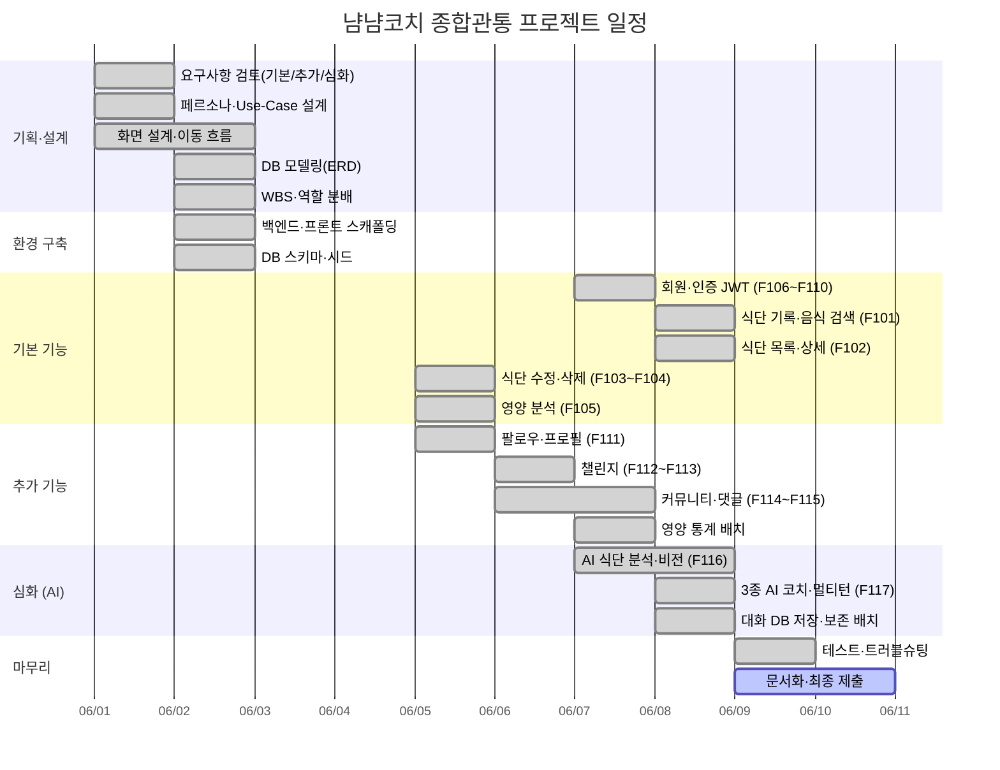

# Gantt Chart — 냠냠코치

> 날짜는 예시(2026-06-01 ~ 06-10)입니다. 실제 프로젝트 기간으로 수정하세요.
> GitLab은 Mermaid를 자동 렌더링합니다.

```mermaid
gantt
    title 냠냠코치 종합관통 프로젝트 일정
    dateFormat YYYY-MM-DD
    axisFormat %m/%d

    section 기획·설계
    요구사항 검토(기본/추가/심화)   :done, p1, 2026-06-01, 1d
    페르소나·Use-Case 설계          :done, p2, 2026-06-01, 1d
    화면 설계·이동 흐름             :done, p3, 2026-06-01, 2d
    DB 모델링(ERD)                  :done, p4, 2026-06-02, 1d
    WBS·역할 분배                   :done, p5, 2026-06-02, 1d

    section 환경 구축
    백엔드·프론트 스캐폴딩          :done, e1, 2026-06-02, 1d
    DB 스키마·시드                  :done, e2, 2026-06-02, 1d

    section 기본 기능
    회원·인증 JWT (F106~F110)       :done, b1, 2026-06-07, 1d
    식단 기록·음식 검색 (F101)      :done, b2, 2026-06-08, 1d
    식단 목록·상세 (F102)           :done, b3, 2026-06-08, 1d
    식단 수정·삭제 (F103~F104)      :done, b4, 2026-06-05, 1d
    영양 분석 (F105)                :done, b5, 2026-06-05, 1d

    section 추가 기능
    팔로우·프로필 (F111)            :done, a1, 2026-06-05, 1d
    챌린지 (F112~F113)              :done, a2, 2026-06-06, 1d
    커뮤니티·댓글 (F114~F115)       :done, a3, 2026-06-06, 2d
    영양 통계 배치                  :done, a4, 2026-06-07, 1d

    section 심화 (AI)
    AI 식단 분석·비전 (F116)        :done, s1, 2026-06-07, 2d
    3종 AI 코치·멀티턴 (F117)       :done, s2, 2026-06-08, 1d
    대화 DB 저장·보존 배치          :done, s3, 2026-06-08, 1d

    section 마무리
    테스트·트러블슈팅               :done, f1, 2026-06-09, 1d
    문서화·최종 제출                :active, f2, 2026-06-09, 2d
```
