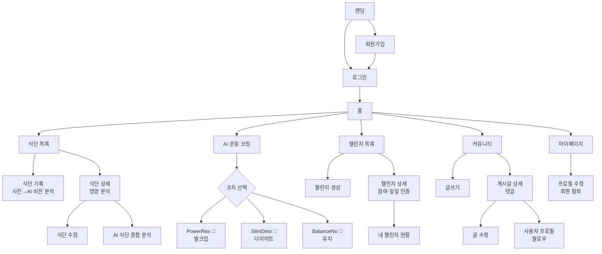

# 화면 설계 — 냠냠코치

## 1. 전체 화면 목록 (22개)

| 영역 | 화면 | 라우트 | 인증 | 관련 요구사항 |
|------|------|--------|:--:|------|
| 진입 | 홈 | `/` | - | - |
| 진입 | 랜딩 | `/landing` | - | - |
| 회원 | 로그인 | `/member/login-form` | - | F110 |
| 회원 | 회원가입 | `/member/regist-member-form` | - | F106 |
| 회원 | 마이페이지 | `/auth/mypage` | 🔒 | F107 |
| 회원 | 회원 상세 | `/auth/member-detail` | 🔒 | F107 |
| 회원 | 프로필 수정 | `/auth/member-modify-form` | 🔒 | F108, F109 |
| 회원 | 회원 목록 | `/auth/member-list` | 🔒 | F107 |
| 식단 | 식단 목록 | `/auth/diet` | 🔒 | F102 |
| 식단 | 식단 기록 | `/auth/diet/write` | 🔒 | F101, F116심화 |
| 식단 | 식단 상세 | `/auth/diet/:dno` | 🔒 | F102, F104, F105 |
| 식단 | 식단 수정 | `/auth/diet/:dno/modify` | 🔒 | F103 |
| AI | AI 식단 분석 | `/auth/ai/diet-analysis` | 🔒 | F116 |
| AI | AI 운동 코칭 | `/auth/ai/workout-coach` | 🔒 | F117 |
| AI | AI 채팅 | `/auth/ai/chat` | 🔒 | F-S2 |
| 챌린지 | 챌린지 목록 | `/auth/challenge` | 🔒 | F112 |
| 챌린지 | 챌린지 생성 | `/auth/challenge/create` | 🔒 | F112 |
| 챌린지 | 내 챌린지 | `/auth/challenge/my` | 🔒 | F113 |
| 챌린지 | 챌린지 상세 | `/auth/challenge/:cno` | 🔒 | F112, F113 |
| 커뮤니티 | 게시판 목록 | `/auth/community` | 🔒 | F114 |
| 커뮤니티 | 글쓰기/수정 | `/auth/community/write`, `/:bno/modify` | 🔒 | F114 |
| 커뮤니티 | 게시글 상세 | `/auth/community/:bno` | 🔒 | F114, F115 |
| 소셜 | 사용자 프로필 | `/auth/user/:email` | 🔒 | F111 |
| 공통 | 에러 페이지 | `/*` | - | - |

공통 컴포넌트: 헤더(내비게이션), 푸터, 페이지네이션, 검색, 카카오맵, 가이드 챗봇(전역 위젯)

## 2. 화면 이동 흐름도



## 3. 주요 화면 레이아웃

### 3-1. 식단 기록 (F101 + F116심화)

```
┌────────────────────────────────┐
│  식단 기록하기 📸               │
│  ┌──────────────────────────┐  │
│  │   📷 사진 업로드 영역      │  │
│  └──────────────────────────┘  │
│  [ 🦕 AI 영양 분석 ]  ← 비전 AI │
│  ┌ 분석 결과 (자동 채움) ────┐  │
│  │ 음식명·칼로리·영양소       │  │
│  └──────────────────────────┘  │
│  음식 DB 검색·선택 / 끼니·날짜  │
│  [ 저장 ]                      │
└────────────────────────────────┘
```

### 3-2. AI 운동 코칭 (F117)

```
┌────────────────────────────────┐
│  AI 운동 코칭 💪                │
│ ┌────────┬────────┬─────────┐ │
│ │PowerRex│SlimDino│BalanceNo│ │  ← 코치 선택 카드
│ │  🦖    │  🦕    │   🐢    │ │
│ └────────┴────────┴─────────┘ │
│ ┌──────────────────────────┐  │
│ │ 🦖 PowerRex (헤더)        │  │
│ │ ┌─ 채팅 영역 ───────────┐ │  │
│ │ │ 코치: 인사/저장된 대화 │ │  │
│ │ │           사용자: 질문 │ │  │
│ │ │ 코치: 운동·식단·동기   │ │  │
│ │ └───────────────────────┘ │  │
│ │ [입력창]          [전송]  │  │
│ └──────────────────────────┘  │
└────────────────────────────────┘
```

### 3-3. 식단 상세 (F102/F104/F105)

```
┌────────────────────────────────┐
│ 식단명         [수정] [삭제]    │
│ ┌────────────┬──────────────┐ │
│ │ 📷 사진     │ 영양 분석     │ │
│ │ 음식 구성   │ kcal 대형표시 │ │
│ │ - 음식 a    │ 단백질 ▓▓▓░  │ │
│ │ - 음식 b    │ 탄수   ▓▓░░  │ │
│ │            │ 지방   ▓░░░  │ │
│ │            │ [AI 종합분석] │ │
│ └────────────┴──────────────┘ │
└────────────────────────────────┘
```

### 3-4. 챌린지 상세 (F112/F113)

```
┌────────────────────────────────┐
│ 🏆 히어로 배너 (제목·기간·인원) │
│ ┌────────────┬──────────────┐ │
│ │ 설명        │ 내 달성도     │ │
│ │ [참여하기]  │   ◯ 70%     │ │
│ │ [오늘 인증] │ 7/10일 달성  │ │
│ └────────────┴──────────────┘ │
└────────────────────────────────┘
```

> 디자인 시스템: 공룡 테마(dino.css) — teal/tan 팔레트, cloud-card, 라운드 pill 버튼.
> 실제 구현 화면 캡처는 `docs/images/`에 추가 예정.
