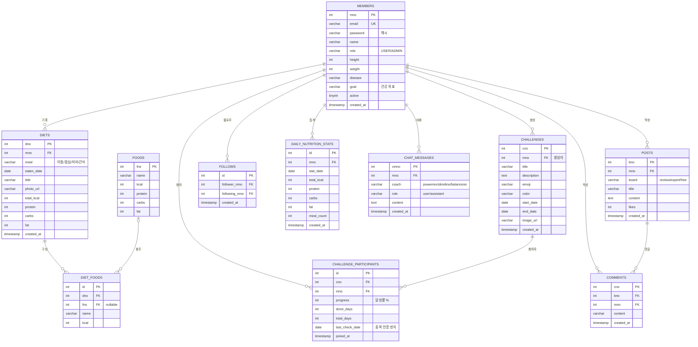

# DB Modeling ERD — 냠냠코치

> 근거: `backend/src/main/resources/schema.sql` (MySQL 8, InnoDB, utf8mb4)

## 1. ERD

## 2. 설계 포인트

| 항목 | 내용 |
|------|------|
| 참조 무결성 | 회원 탈퇴 시 식단·챌린지·게시글·댓글·AI 대화 `ON DELETE CASCADE` 자동 정리 |
| 비정규화 | `diets`에 총 칼로리·매크로를 저장해 목록 조회 시 diet_foods 조인 생략 (조회 성능) |
| 유니크 제약 | `members.email`, `challenge_participants(cno,mno)` — 중복 참여 방지, `follows(follower,following)` — 중복 팔로우 방지, `daily_nutrition_stats(mno,stat_date)` — 일별 1행 |
| 인덱스 | `chat_messages(mno,coach,cmno)` 대화 복원 조회용, `chat_messages(created_at)` 90일 정리 배치용 |
| 데이터 수명 | `chat_messages`는 90일 보존 후 스케줄러가 삭제 — 저장 공간 상한 유지 |
| 통계 분리 | 일일 집계를 `daily_nutrition_stats`로 분리해 원본(diets) 스캔 없이 14일 추이 제공 |
